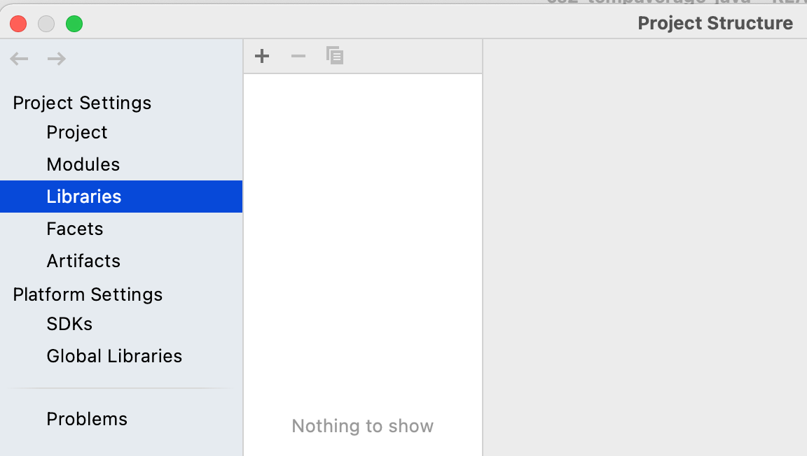
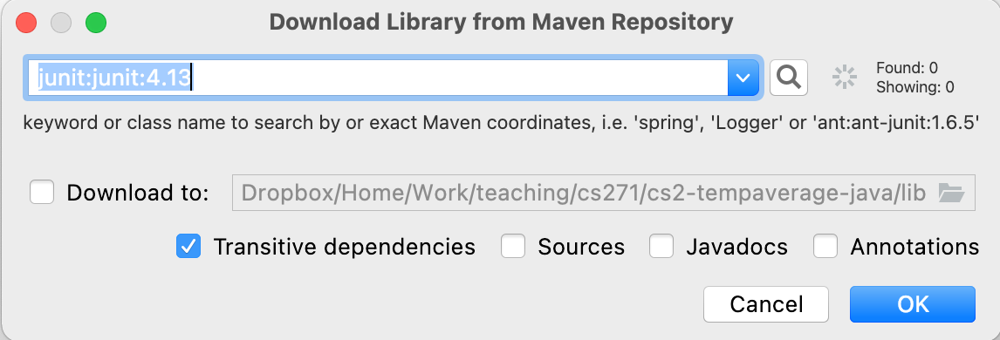
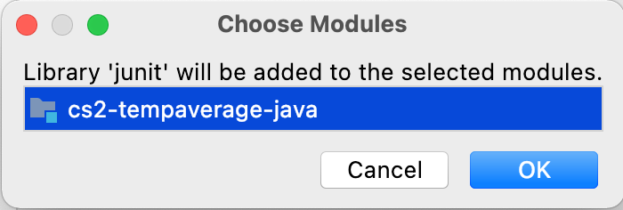

# Steps for adding the JUnit library to this project

- File (top-level menu) > Project Structure
- Project Settings > Libraries > + (plus) button > From Maven
  
- Popup Download Library from Maven Repository 
  
  - enter `junit:junit:4.13`
  - make sure Transitive dependencies is checked
  - leave everything else unchecked
  - OK
- Popup Library will be added > OK 
  